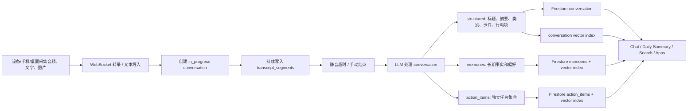
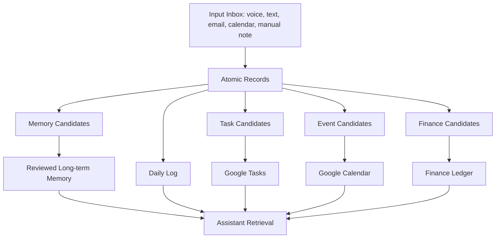
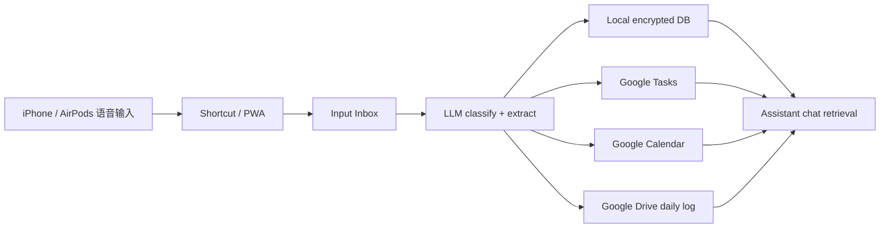

# Omi 信息处理链路分析与个人数据库设计参考

> 分析对象：`https://github.com/BasedHardware/omi`
>
> 本地查看版本：`d2a8ea83e52e76fdfbca6f757d857946c1e65fe0`
>
> 目的：理解 Omi 如何把连续音频/文本流变成可查询的“生活记忆”，并提炼成我们自己的个人 assistant / personal database 信息处理方案。

## 0. 主要来源文件

这份分析主要参考了 Omi repo 里的这些文件：

- `README.md`：整体产品和 repo 模块结构。
- `docs/doc/developer/Protocol.mdx`：设备 BLE 音频协议。
- `docs/doc/developer/backend/transcription.mdx`：WebSocket 转录接口。
- `docs/doc/developer/backend/listen_pusher_pipeline.mdx`：实时录入、conversation lifecycle、Pusher 处理流程。
- `docs/doc/developer/backend/StoringConversations.mdx`：conversations / memories / action_items 的存储模型。
- `docs/doc/developer/backend/chat_system.mdx`：agentic chat retrieval 设计。
- `docs/doc/info/Privacy.mdx`：隐私说明。
- `backend/models/*.py`：conversation、structured、memory、transcript segment、enum 等模型。
- `backend/database/*.py`：Firestore 存取、加密、查询、action item 和 memory collection。
- `backend/database/vector_db.py`：Pinecone namespaces、向量写入和查询。
- `backend/utils/conversations/process_conversation.py`：conversation 处理主流程。
- `backend/utils/llm/conversation_processing.py`：摘要、分类、事件和任务抽取。
- `backend/utils/llm/memories.py` 与 `backend/utils/prompts.py`：memory 提取规则。
- `backend/utils/retrieval/agentic.py` 与 `backend/utils/retrieval/tools/*.py`：chat agent 如何按需拉取 conversations、memories、action items。

## 1. 一句话结论

Omi 的核心设计不是直接把“一天”作为数据库主对象，而是把每天拆成很多个 `conversation`，再从每个 conversation 里提取三类派生数据：

1. `structured`：标题、概览、类别、事件、行动项等结构化摘要。
2. `memories`：长期有用的事实、偏好、关系、项目、想法。
3. `action_items`：可完成、可同步到任务系统的待办事项。

“今天发生了什么”不是原始存储单元，而是一个按时间范围拉取 conversations / memories / action_items 后生成的视图。

这点非常适合我们借鉴：底层存“事件/对话原子”，上层再生成 daily log、周报、todo、关系提醒和财务提醒。

## 2. Omi 的整体信息流



Omi 的信息处理可以分成六层：

1. Capture：设备、手机、桌面或外部集成产生音频/文本/图片。
2. Transcription：音频流转成带 speaker 的 transcript segment。
3. Conversation Lifecycle：把一段连续信息流管理成一个 conversation。
4. Processing：LLM 判断是否保留、摘要、分类、提取行动项和记忆。
5. Storage / Index：Firestore 保存主数据，Pinecone 保存向量索引。
6. Retrieval：聊天 agent 根据问题调用 conversations、memories、action_items、calendar、Gmail 等工具。

## 3. 采集层：输入不是只有麦克风

Omi 支持多种 source，后端枚举里包括：

- `omi`：Omi wearable 硬件。
- `desktop`：桌面端。
- `phone` / `phone_call`：手机或电话。
- `fieldy` / `bee` / `plaud` / `limitless`：第三方设备或类似来源。
- `screenpipe`：屏幕活动。
- `external_integration`：外部集成导入的文字或音频。
- `sdcard`：本地存储导入。
- `workflow`：自动化流程产生的数据。

这说明 Omi 的后端设计没有把“设备”写死。设备只是 source 之一，真正进入系统的是标准化后的 conversation。

对我们的启发：

- 第一版不应该被硬件绑定死。
- iPhone / AirPods / 快捷指令 / PWA / Telegram / Google 账号都可以作为输入口。
- 后端应该统一成 `source` 字段，这样未来换 Omi、PLAUD、自研设备或手机录音都不用重写数据库。

## 4. 音频到 transcript 的处理

Omi 的 BLE 设备协议里，音频通过专门的 Audio Service 发送。音频格式支持 PCM、Mu-law、Opus 等编码。后端转录接口是 `/v4/listen` WebSocket。

转录输入：

- `uid`
- `language`
- `sample_rate`
- `codec`
- `channels`
- `source`
- `conversation_timeout`
- `include_speech_profile`
- `custom_stt`

转录输出是 `transcript_segments`，典型字段是：

```json
{
  "id": "segment-id",
  "text": "今天下午提醒我发账单。",
  "speaker": "SPEAKER_00",
  "speaker_id": 0,
  "is_user": true,
  "person_id": "optional-person-id",
  "start": 12.3,
  "end": 15.8,
  "speech_profile_processed": true,
  "stt_provider": "deepgram"
}
```

Omi 使用 Deepgram 做实时转录，并启用 diarization 来区分说话人。后端还会把连续、同一 speaker 或疑似同一句话延续的 segment 合并，避免一句话被切成太多碎片。

对我们的启发：

- 原始音频不是最重要的长期数据，长期可用的是 segment 化文字。
- 每个 segment 要保留时间戳、speaker、person_id、source、置信度。
- 如果做隐私优先版，默认不保存 raw audio，只保存转录文本和摘要；高敏感场景甚至只保存摘要。

## 5. Conversation 生命周期

Omi 的 conversation 有状态机：

- `in_progress`：正在录入或转录。
- `processing`：录入结束，等待 LLM 处理。
- `merging`：可能与其他 conversation 合并。
- `completed`：结构化处理完成。
- `failed`：处理失败。

后端会在 WebSocket 开始时创建一个 stub conversation，然后边转录边写 transcript。静音超时后，conversation 进入 processing，由后续任务生成摘要、行动项、记忆和向量。

重要设计点：

- “实时记录”和“事后理解”是两条链路。
- 录入时只保证完整、低延迟。
- 处理时再做分类、摘要、记忆提取、任务生成。

对我们来说，这意味着系统要允许“不完美的临时记录”。例如：

- 手机上快速说一句 “明天提醒我给房东转账”。
- 系统立刻存一条 pending record。
- 晚上统一做 digest，判断它是 todo、账单、财务记录还是普通记忆。

## 6. 主数据模型：Conversation

Omi 的主存储路径是：

```text
users/{uid}/conversations/{conversation_id}
```

核心字段可以概括成：

```json
{
  "id": "conversation-id",
  "uid": "user-id",
  "created_at": "2026-05-13T10:00:00Z",
  "started_at": "2026-05-13T09:55:00Z",
  "finished_at": "2026-05-13T10:08:00Z",
  "source": "omi",
  "language": "en",
  "status": "completed",
  "transcript_segments": [],
  "structured": {
    "title": "Discussed rent payment",
    "overview": "User mentioned needing to pay rent tomorrow.",
    "emoji": "🏠",
    "category": "finance",
    "action_items": [],
    "events": []
  },
  "geolocation": null,
  "photos": [],
  "audio_files": [],
  "apps_results": [],
  "visibility": "default",
  "data_protection_level": "standard",
  "is_locked": false,
  "starred": false,
  "folder_id": null
}
```

Omi 把 `conversation` 当成一切的母体。memory、action item、vector、app result 都可以追溯到某个 conversation。

这对我们很重要：任何自动生成的 todo / 记忆 / 财务提醒，都应该能回到“它为什么被创建”的原始证据。

## 7. Structured：把对话变成摘要、类别、事件、任务

Omi 的 `structured` 模型主要包含：

- `title`：不超过约 10 个词的标题。
- `overview`：简短概览。
- `emoji`：视觉标识。
- `category`：内容类别。
- `action_items`：从这段对话里抽出的任务。
- `events`：从这段对话里抽出的日历事件。

类别枚举很宽，包括：

- personal
- health
- finance
- legal
- work
- business
- education
- family
- romantic
- social
- travel
- technology
- entrepreneurship
- parenting
- news
- entertainment
- other

Omi 的处理逻辑会先判断一段 conversation 是否值得保留：

- 超过一定长度的 transcript 通常保留。
- 很短的内容会交给 LLM 判断。
- 问候、无意义片段、纯噪声会丢弃。
- 任务、承诺、决定、个人事实、重要事件、问题、照片相关内容会保留。

对我们的启发：

- 不要把所有声音都永久保存，必须有 discard / keep 判断。
- category 应该只作为粗分类，不要承担所有检索职责。
- 真正强的检索来自：时间、人物、主题、实体、地点、任务状态、敏感级别、向量。

## 8. Memory：长期事实不是原始 transcript

Omi 的 memory 存储路径是：

```text
users/{uid}/memories/{memory_id}
```

memory 不是完整对话，而是从 conversation 中提取出来的长期事实。Omi 的 memory 大致分三类：

- `system`：关于用户的事实、偏好、关系、项目、行动、观点。
- `interesting`：别人说过的、有长期价值的建议、信息或观点。
- `manual`：用户手动添加的记忆。

Omi 的 memory 提取规则很严格：

- 每段 conversation 最多提取少量 memory。
- 每条 memory 尽量短，约 15 个词以内。
- 跳过日常琐碎、低影响、泛泛而谈、无法确认的人际关系。
- 不写 “Speaker 0”，如果 speaker 身份不确定就不要强行命名。
- 与已有 memory 相似时，会做去重、合并或保留冲突版本。

一个 memory 可以理解成：

```json
{
  "id": "memory-id",
  "uid": "user-id",
  "content": "User prefers paying bills before the due date.",
  "category": "system",
  "tags": ["finance", "preference"],
  "conversation_id": "source-conversation-id",
  "reviewed": false,
  "user_review": null,
  "visibility": "default",
  "data_protection_level": "standard",
  "is_locked": false,
  "created_at": "2026-05-13T10:10:00Z",
  "updated_at": "2026-05-13T10:10:00Z"
}
```

对我们的启发：

- “记忆”必须是被压缩后的事实，不是全文聊天记录。
- 记忆要有来源 conversation。
- 高价值记忆最好有 review gate，也就是用户确认后再进入长期核心记忆。
- 对朋友、家人、财务、健康、恋爱、法律相关内容要默认更谨慎。

## 9. Action Items：任务要独立成集合

Omi 的 action item 存储路径是：

```text
users/{uid}/action_items/{action_item_id}
```

典型字段：

```json
{
  "id": "task-id",
  "description": "Pay rent tomorrow",
  "completed": false,
  "created_at": "2026-05-13T10:10:00Z",
  "updated_at": "2026-05-13T10:10:00Z",
  "due_at": "2026-05-14T17:00:00Z",
  "completed_at": null,
  "conversation_id": "source-conversation-id"
}
```

Omi 把 action item 从 conversation 里复制到独立 collection，这样检索任务时不需要扫全部对话。

处理策略：

- 从 transcript 中抽取明确的任务、承诺、提醒。
- 对可能重复的开放任务做语义去重。
- 不确定时倾向提取，但重复判断要保守。
- due date 要尽量具体，不能把模糊日期随意写死。
- 可以同步到外部任务系统。

对我们的设计，这一层可以直接对接 Google Tasks：

- conversation 是证据。
- action item 是系统内部任务对象。
- Google Tasks 是跨设备提醒和手机展示层。

## 10. 向量索引：搜索不直接扫全文

Omi 使用 Pinecone 做向量索引，namespace 大致包括：

- `ns1`：conversations
- `ns2`：memories
- `ns3`：screen activity
- `ns4`：action items

值得注意的是，conversation vector 不是直接 embed 全量 transcript，而是 embed `structured` 内容，例如 title、overview、action_items、events。

优点：

- 成本更低。
- 隐私暴露少于全文 embedding。
- 搜索结果更像“事件摘要”。

缺点：

- 如果摘要漏掉细节，语义搜索可能找不到。
- 对原话、金额、名字、细节追溯仍需要回到 transcript。

Omi 还会从 transcript 或 summary 中提取 metadata：

- people
- topics
- entities
- dates
- created_at

然后搜索可以组合：

- vector similarity
- uid filter
- date range
- metadata filter

对我们的启发：

- 可以把全文 embedding 当成可选项，而不是默认项。
- 默认 embed 摘要和显式 metadata，更利于隐私。
- 高敏感 conversation 可以不进向量库，或只进本地加密索引。

## 11. Retrieval：用的时候怎么 pull

Omi 的聊天不是把所有数据一次性塞给 LLM，而是 agent 按问题调用工具。

主要 retrieval 工具有：

| 用户问题类型 | Omi 倾向调用的数据 |
| --- | --- |
| “今天发生了什么？” | `get_conversations` 按日期拉 summary，必要时拉 action_items/events |
| “我上次和某人聊了什么？” | date/person filter + semantic conversation search |
| “你记得我喜欢什么吗？” | `get_memories` 或 `search_memories` |
| “我有什么待办？” | `get_action_items`，优先按 due date |
| “帮我找那次说到账单的对话” | `search_conversations` 向量搜索，再回源 conversation |
| “这个任务完成了吗？” | action_items collection |
| “把这个加入日历/任务” | calendar/task tool，而不是只写文本 |

Omi 的 `get_conversations_tool` 默认更偏 summary，不默认拉完整 transcript。只有用户明确需要细节或原话时，才拉 transcript segments。

这点很关键：个人 assistant 的上下文应该“逐级展开”：

1. 先查 memory / summary / task。
2. 不够再查 conversation overview。
3. 还不够才拉 transcript。
4. 高敏感内容需要用户确认或更严格权限。

## 12. Daily Log：一天是一种视图，不是主表

Omi 的设计里，“每天的信息”不是一开始就写成一篇日记。它更像：

```text
May 13 daily view =
  conversations where started_at/created_at within May 13
  + memories created from those conversations
  + action_items created/due that day
  + events from structured output
  + calendar context
  + app results
```

这样做的好处：

- 一天中每件事仍可独立追溯。
- 可以按人物、任务、项目、财务、健康重新组织。
- 同一条 conversation 可以同时出现在 daily log、friend relationship log、finance log 里。

对我们的系统，建议生成两层 daily log：

1. `daily_raw_index`：当天有哪些原子记录、任务、事件、记忆候选。
2. `daily_narrative_log`：给人读的自然语言日记/总结。

底层不要只存自然语言日记，否则未来很难做精确检索和自动化。

## 13. 隐私与安全观察

Omi 的普通后端是 cloud-heavy：

- Deepgram 做转录。
- Firestore 存 conversations / memories / action_items。
- Pinecone 存向量。
- GCS 可存 audio chunks。
- Pusher 参与处理流水线。
- LLM 服务做摘要、记忆提取、任务抽取。

Omi 文档也提到 wearable app / BYO API key / local storage 的隐私方向，但主后端架构仍明显依赖云服务。

需要注意的隐私点：

- 即使 transcript 加密，summary、metadata、embedding 也可能泄露语义。
- people/topics/entities/dates 这些 metadata 本身就很敏感。
- 向量库里不一定能还原原文，但可以暴露“你和谁、关于什么、何时”。
- 自动提取 memory 可能误记人际关系、健康、财务、法律事实。
- 代码中有一个过期提示词痕迹：metadata 日期提取 prompt 出现了 “不要包含大于 2025 的日期”。现在已经是 2026，这类静态 prompt 会造成长期系统 bug。

我们的系统应该把隐私标签作为一等字段：

- `sensitivity`: normal / private / financial / health / legal / intimate
- `consent_state`: self_only / other_party_present / unknown
- `retention_policy`: ephemeral / 30d / 1y / permanent
- `storage_policy`: local_only / encrypted_cloud / google_readable_summary
- `embedding_policy`: none / summary_only / full_text
- `review_state`: unreviewed / approved / rejected / corrected

## 14. 推荐给我们自己的信息处理架构

### 14.1 核心原则

1. 原始输入可以多源，但入库格式统一。
2. 主对象是 `record` 或 `conversation`，不是 daily log。
3. todo、memory、event、finance item 都是派生对象，并且保留 source id。
4. 隐私策略必须比 Omi 更前置。
5. Google 系列适合做跨设备展示层，但不一定适合做全部底层数据库。

### 14.2 建议数据层



建议的 collections / tables：

- `records`：原子记录。语音片段、聊天片段、邮件摘要、手动笔记都进这里。
- `transcript_segments`：如果一条 record 来自音频，保存分段文字。
- `daily_logs`：每天自动生成的人类可读总结。
- `memory_candidates`：AI 提取但未确认的记忆候选。
- `memories`：确认后的长期记忆。
- `tasks`：内部任务对象，同步到 Google Tasks。
- `events`：内部事件对象，同步到 Google Calendar。
- `finance_items`：账单、订阅、转账、报销、收入/支出候选。
- `people`：联系人、关系、生日、偏好、最近互动。
- `source_accounts`：Google、邮箱、未来微信导出等账号连接信息。
- `audit_log`：每次 AI 创建/修改/删除对象的原因和来源。

### 14.3 建议 record schema

```json
{
  "id": "record-id",
  "user_id": "kaiwen",
  "source": "voice_shortcut",
  "source_ref": "optional-external-id",
  "created_at": "2026-05-13T10:00:00-04:00",
  "started_at": "2026-05-13T09:58:00-04:00",
  "ended_at": "2026-05-13T10:00:00-04:00",
  "timezone": "America/New_York",
  "record_type": "conversation",
  "status": "processed",
  "language": "zh",
  "title": "提醒房租和账单",
  "summary": "提到明天需要处理房租和信用卡账单。",
  "category": "finance",
  "people": [],
  "topics": ["rent", "credit card bill"],
  "entities": ["landlord", "credit card"],
  "sensitivity": "financial",
  "consent_state": "self_only",
  "retention_policy": "1y",
  "storage_policy": "encrypted_cloud",
  "embedding_policy": "summary_only",
  "raw_audio_ref": null,
  "transcript_ref": "transcript-record-id",
  "derived_object_ids": {
    "tasks": ["task-id"],
    "memories": [],
    "finance_items": ["finance-item-id"]
  }
}
```

### 14.4 推荐处理流程

1. Capture
   - 手机、AirPods、PWA、快捷指令、Google API、手动输入都先进 inbox。

2. Normalize
   - 统一时间、source、语言、文本格式。
   - 音频先转 transcript segments。

3. Classify
   - 判断是 conversation、task note、finance note、relationship note、calendar event、random thought。
   - 判断敏感级别和保存策略。

4. Extract
   - 从 record 提取 task/event/memory/finance/person update。
   - 所有提取物先带 `source_record_id`。

5. Review
   - 财务、健康、法律、关系类 memory 默认进入候选区。
   - 用户确认后才进入长期 memory。

6. Sync
   - 明确任务同步到 Google Tasks。
   - 明确事件同步到 Google Calendar。
   - 可读 daily log 写入 Google Drive / Docs。

7. Retrieve
   - 问日期：查 daily_logs + records。
   - 问事实：查 memories。
   - 问任务：查 tasks / Google Tasks。
   - 问人：查 people + related records。
   - 问钱：查 finance_items + bills。
   - 不够时再回源 transcript。

## 15. 我们可以借鉴 Omi，但要改的地方

| 模块 | Omi 做法 | 我们建议 |
| --- | --- | --- |
| 主对象 | conversation | record/conversation，兼容更多输入 |
| 每日总结 | 按日期拉 conversations 生成 | 同样做成 view，不做主存储 |
| 记忆 | 自动提取后存 memories | 加 review gate，敏感内容默认不自动永久化 |
| 任务 | action_items 独立 collection | 内部 tasks + Google Tasks 双写/同步 |
| 向量 | structured summary embedding | 默认 summary embedding，高敏感可禁用 |
| 原始音频 | 可云端同步 | 默认不保存，或本地短期缓存 |
| 隐私 | 有 enhanced encryption，但云依赖重 | local-first + 用户可读 Google 层 + 明确 retention |
| 检索 | agent tools 按需 pull | 保留这种方式，增加权限和敏感度检查 |

## 16. 最适合我们的 MVP 信息流

第一阶段可以不用自研设备，先做这个闭环：



MVP 的最小可用能力：

- 语音快速记事。
- 自动识别 todo，并出现在手机 Google Tasks。
- 自动识别日期事件，并进入 Google Calendar。
- 每晚生成一篇 daily log 到 Google Drive。
- 从 daily log 和 memory 中回答：“我今天做了什么？我还有什么事没做？我上次和某人聊了什么？”

第二阶段再加：

- 邮箱读取和账单识别。
- 朋友生日/关系互动提醒。
- 财务 subscription / bill tracker。
- 微信聊天导出后的导入解析。
- 可穿戴设备连续记录。

第三阶段才考虑：

- 自研硬件。
- 本地语音唤醒。
- 离线转录。
- 长时间全天候录音。

## 17. 关键设计决定

我建议我们定下这些基础决定：

1. 不以“全天录音文件”为核心资产，而以 `record -> derived objects -> daily view` 为核心。
2. 原始音频默认短期保存或不保存。
3. 长期 memory 必须有来源、时间、敏感度、review 状态。
4. Todo 和 Calendar 不只存在 assistant 数据库里，要同步到手机原生可见系统。
5. Google Drive 可以做人类可读层，底层数据库仍需要结构化存储。
6. 所有自动写入都进入 audit log，未来可以解释“为什么我记住了这件事”。

## 18. 下一步建议

下一份文档可以从这份分析继续展开成我们的正式系统设计：

- `personal-assistant-data-model.md`：具体表结构和字段。
- `mvp-google-integration-plan.md`：Google Tasks / Calendar / Drive 的第一版集成。
- `privacy-policy-and-retention-rules.md`：哪些数据能存、存多久、是否进向量。
- `voice-capture-mvp.md`：iPhone + AirPods + Shortcut/PWA 的录入方案。

我建议先写 `personal-assistant-data-model.md`，因为它会决定后面 Google、语音设备、聊天检索如何接进来。
