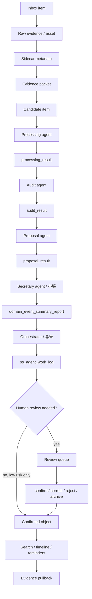

# 05. Echo End-To-End Map

This is the current end-to-end map for Echo's local-first personal memory workflow.



## Serial Agent Rule

Each secretary agent can only run one active processing/audit/proposal chain at a time.

```text
active_chain_id != null
  -> no new chain

active_chain_id == null and next_spawn_allowed == true
  -> next chain may start
```

## Review Gate

The review gate is mandatory for:

```text
medical
financial
legal
account_security
identity
relationship
delete_or_merge_proposal
```

Low-risk generated artifacts can be automated only when they remain in working/cache layers.

## Evidence Pullback

Every important answer should be able to pull back to:

```text
file path
content hash
packet id
page / line / message / timestamp locator
citation ref
review result
work log entry
```

If Echo cannot explain why a memory was written or updated, the write is not valid.
