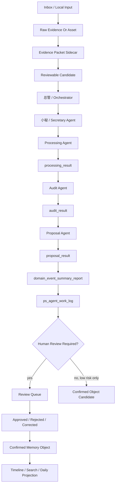

# 05. Echo End-To-End Map

This map shows the current Echo personal memory workflow from inbox to work log. It describes the dry-run architecture, not a production backend.



## Processing Order

```text
1. Receive local input or fake evidence.
2. Preserve raw evidence.
3. Create evidence packet sidecar.
4. Create reviewable candidate.
5. 总管 assigns one work item to a secretary agent.
6. Secretary starts one active processing chain.
7. Processing agent handles one small evidence packet.
8. Audit agent checks traceability, citations, and risk.
9. Proposal agent returns review_result / update_proposal / no_action.
10. Secretary creates domain_event_summary_report.
11. 总管 updates ps_agent_work_log.
12. next_spawn_allowed remains false until required review/logging is complete.
13. Human review approves, corrects, rejects, or archives.
14. Confirmed objects feed projections and search.
```

## What Is Stored Where

| Data | Stored In | Purpose |
| --- | --- | --- |
| raw evidence | `runtime/truth/raw_evidence/` | durable source material |
| evidence packet metadata | `runtime/truth/sidecars/` | citeable packet wrapper |
| candidate | `runtime/working/review_queue/` | reviewable possible memory/update |
| processing/audit/proposal results | `runtime/working/agent_work_log/` | traceable working records |
| secretary report | `runtime/working/domain_reports/` | domain-level report to 总管 |
| PS work log | `runtime/working/agent_work_log/` | global serialized gate |
| confirmed memory | `runtime/truth/confirmed_objects/` | future reviewed truth |
| OCR/FTS/embeddings | `runtime/cache/` | rebuildable cache |

## Most Important Design Pattern

Echo keeps four layers separate:

```text
Evidence layer:
  raw files, source exports, sidecars, citation refs

Working layer:
  candidates, processing results, audit results, proposals, work logs

Truth layer:
  reviewed confirmed memory objects and object history

Projection/cache layer:
  timeline, daily summary, search index, OCR, embeddings, export bundles
```

The workflow is valid only if a future reader can explain why a memory was written or updated.
