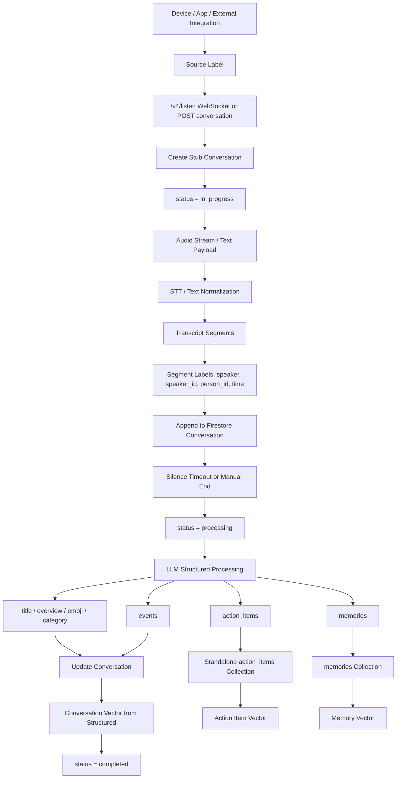

# 05. End-To-End Map

这是一张把 Omi 的 inflow、segmentation、labeling、transition to DB 合起来的总图。



## Processing Order

实际处理顺序可以理解为：

```text
1. Receive input
2. Assign source/system labels
3. Create or update conversation
4. Segment transcript
5. Wait for conversation boundary
6. Decide discard or keep
7. Generate structured labels
8. Save structured conversation
9. Extract memories
10. Extract action items
11. Write standalone collections
12. Create vector indexes
13. Mark completed
```

## What Is Stored Where

| Data | Stored In | Purpose |
| --- | --- | --- |
| raw transcript segments | `conversations` | source evidence |
| title / overview / category | `conversation.structured` | list display and summary |
| action items inline | `conversation.structured.action_items` | backward compatibility and source context |
| action items standalone | `action_items` | task query, completion, sync |
| long-term facts | `memories` | user memory |
| semantic search for conversations | Pinecone `ns1` | search conversations |
| semantic search for memories | Pinecone `ns2` | search facts |
| semantic search for tasks | Pinecone `ns4` | search tasks |

## Label Hierarchy

```text
Conversation
  system labels:
    uid, source, status, created_at, started_at, finished_at
    visibility, folder_id, is_locked, data_protection_level

  transcript segment labels:
    speaker, speaker_id, person_id, is_user, start, end, stt_provider

  semantic labels:
    title, overview, emoji, category

  derived labels:
    memory.category
    action_item.completed
    action_item.due_at
    event.start

  retrieval labels:
    people, topics, entities, dates, created_at
```

## Most Important Design Pattern

Omi keeps three layers separate:

```text
Evidence layer:
  transcript_segments inside conversation

Understanding layer:
  structured summary and labels

Action/retrieval layer:
  memories, action_items, vectors
```

这个分层是它信息处理系统最值得借鉴的地方。

